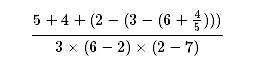

###1.1.6.	条件表达式和谓词

### 练习1.1
> **下面是一系列表达式，对于每个表达式，解释器将输出什么结果？假定这一系列表达式是按照给出的顺序逐个求值的。**

-
	10
	=> 10
-
	(+ 5 3 4)
	=> 12
-
	(- 9 1)
	=> 8
-
	(/ 6 2)
	=> 3
-
	(+ (* 2 4) (- 4 6))
	=> 6
-
	(define a 3)
	=> a
-
	(define b (+ a 1))
	=> b
-
	(+ a b (* a b))
	=> 19
-
	(= a b)
	=> false
-
	(if (and (> b a) (< b (* a b)))
   			b
   			a)
	=> 4
-
	(cond ((= a 4) 6) 
		((= b 4) (+ 6 7 a)) 	
		(else 25))
	=> 16
-
	(+ 2 (if (> b a) b a))
	=> 6
-
	(* (cond ((> a b) a)
         ((< a b) b)
         (else -1))
   	(+ a 1))
	=> 16

### 练习 1.2
> **请将下面表达式变换为前缀形式:**

	(/ (+ 5 4 (- 2 (- 3 (+ 6 (/ 4 5))))) (* 3 (- 6 2) (- 2 7)))

### 练习 1.3
> **请定义一个过程，它以3个数为参数，返回其中较大的两个数之和。**

	(define (sum-of-largest-two x y z)(
        cond ((and (> x y) (> y z))(+ x y))
             ((> x y) (+ x z))
             ((> x z) (+ x y))
             (else (+ y z))
             ))

### 练习 1.4
> **请仔细考察上面给出的允许运算符为复合表达式的组合式的求值模型，根据对这一模型的认识描述下面的过程的行为:**

	(define (a-plus-abs-b a b)
		((if (> b 0) + -) a b))
 a-plus-abs-b 过程中会首先判断传入的参数 b 。如果 b为正 者返回 过程+ 否者返回过程 - 然后将过程作用参数 a b 上。

### 练习 1.5
> **Ben Bitdiddle 发明了一种检测方法，能够确定解释器究竟采用哪种序求值，是采用应用序还是正则序。他定义了下面2个过程:**

	(define (p) (p))
	(define (test x y)(
		if (= x 0) 
			0
			y))
而后他求值如下的表达式：

(test 0 (p))

如果某个解释器采用的是applicative-order evaluation 即先计算再传递 求值，Ben会看到什么情况？如果解释器采用normal-order evaluation 即先传递再计算求值，Ben又会看到什么情况？

答案： 如果是applicative-order evaluation 则表达式(test 0 (p)) 会先去计算(p) 从而进入死循环
如果是normal-order evaluation 先传递再计算则
过程调用替换为

	(if (= x 0)
		0
		(p))
返回结果为0 