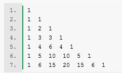
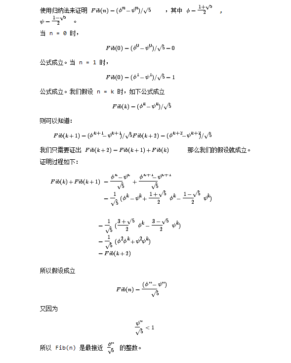

###1.2.2 树形递归

> 练习 1.11 函数f由如下的规则定义：如果 n< 3,那么f(n)=n;如果 n>=3,那么 f(n) = f(n-1)+2f(n-2)+3f(n-3).请写一个采用递归计算过程计算f的过程，在写一个采用迭代计算过程计算f的过程.

	(define (f n)(
		cond ((< n 3) n)
			 (else (+ f(- n 1)) (* 2 (f(- n 2))) (* 3 (f(- n 3))) )	
	))
	
	(define (f/iter n)
  	(define (iter fn-1 fn-2 fn-3 counter)
    (cond ((< n 3) n)
          ((> counter n) fn-1)
          (else
           (iter (+ fn-1 (* 2 fn-2) (* 3 fn-3))
                 fn-1 fn-2
                 (+ counter 1)))))
  	(iter 2 1 0 3))

	
> 练习 1.12 下面数值模式称为帕斯卡三角形：
  
三角形边界上的数都是1，内部的每个数是位于它上面的两个数之和，请写一个过程，采用递归计算过程计算出帕斯卡三角形。

帕斯卡三角的构造由如下规则控制：后面的每一行都通过前一行斜对方位置的两个数相加得到。

  

	(define (pascal row position)( 
   	cond ((= position 1) 1)
		((= position row) 1)
		(else (+ (pascal (- row 1) position ) 	(pascal (- row 1) (- position 1))))
		))

	(pascal 7 2)

>练习 1.13

 

